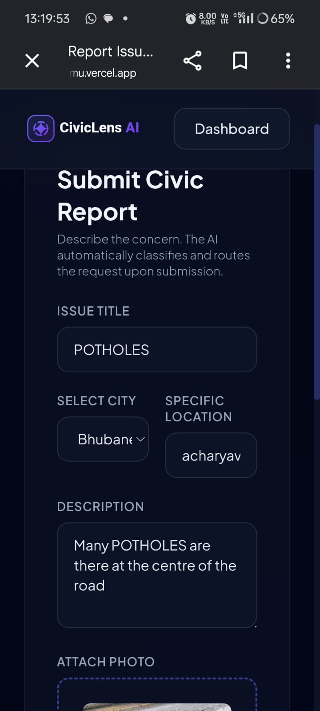
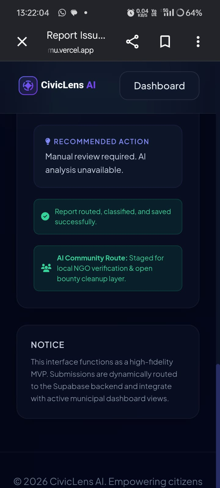

# 🚀 CivicLens | AI-Powered Urban Infrastructure Intelligence

---

## 🌍 The Problem
Urban infrastructure degradation is a silent crisis. Cities struggle to categorize, prioritize, and dispatch repair teams efficiently because traditional reporting systems are manual, slow, and data-siloed.

## 💡 The CivicLens Solution
CivicLens transforms raw citizen reports into **actionable urban intelligence**. By leveraging **Google Gemini AI**, our platform automatically analyzes issue reports in real-time, extracts key data, and categorizes them—slashing response times and enabling data-driven city management.

## 🛠️ Core Features
- **Instant AI Categorization**: Automated analysis of reports using Gemini.
- **Smart Prioritization**: Real-time insights into issue severity.
- **Seamless Reporting**: A frictionless interface for citizens to report infrastructure defects.

## 🚀 Built With
- **Frontend**: Responsive HTML/CSS/JS (Optimized for Mobile)
- **Database**: Supabase (Real-time data management)
- **AI Engine**: Google Gemini API
- **Deployment**: Vercel

## 📸 Platform Showcase

| Landing Page | Dashboard Intelligence |
| :---: | :---: |
|  |  |

---

## 🚀 Getting Started
1. Access the live platform: **[CivicLens Live Demo](https://civiclens-ai-mu.vercel.app/)**
2. Submit a report to see the AI analysis in action.
3. Explore the dashboard to view real-time infrastructure data.

## 💡 Future Roadmap
- [ ] Integration with City API for automated work orders.
- [ ] Predictive maintenance analytics based on report clusters.
- [ ] Multi-language support for diverse urban populations.

---
*Developed for VIBE2SHIP Hackathon | Built by Ankit Pritam Nayak*